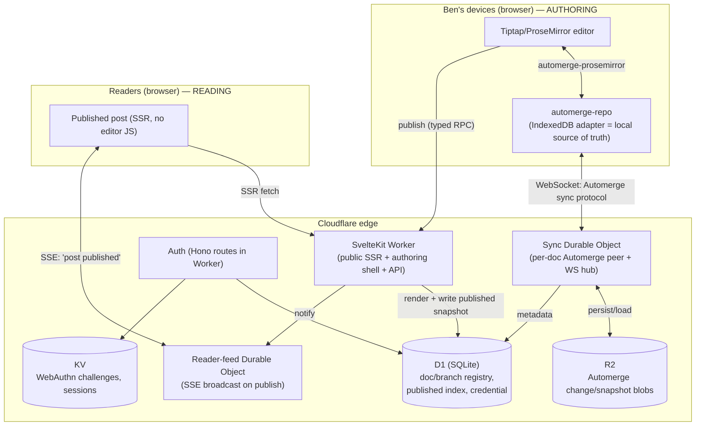
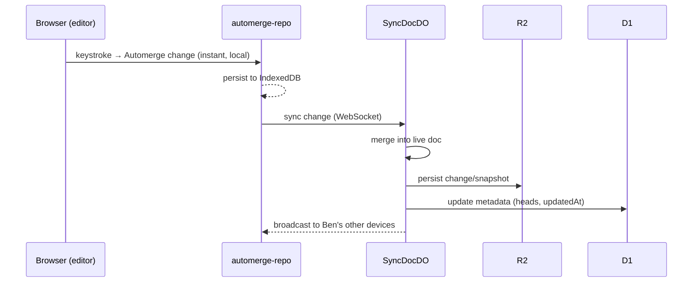
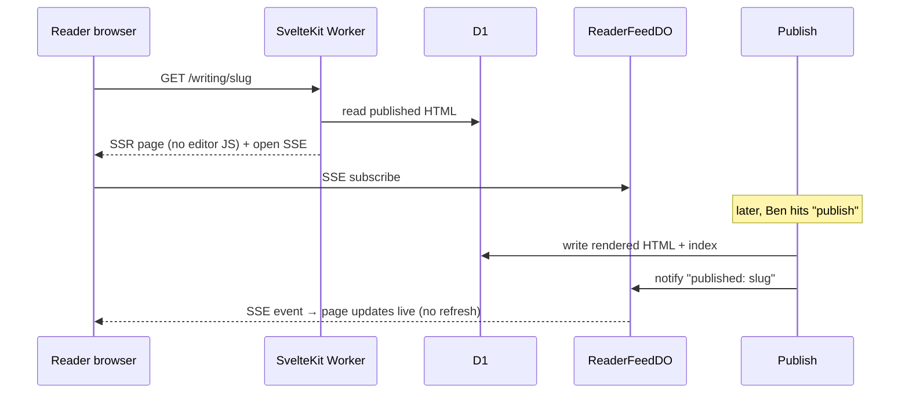

# benstone-writer — Architecture

> A local-first writing & publishing platform that becomes **benstone.me**.
> **Status: v0.1 working draft.** This document is the spec we refine until it can be
> implemented completely and correctly in a single pass. Open questions are marked **⚠️**
> inline and collected in §17. Nothing here is sacred — challenge any choice.

---

## 0. Naming & scope

- **Working name:** `benstone-writer` (placeholder — rename freely). It **replaces** the current Astro `benstone-site`; we keep the Astro site live and cut `benstone.me` over only at the end.
- **Scope (locked — this is the line against scope creep):**
  - Single-author writing tool (just Ben) + a public reader site.
  - **Text only.** No image/video pipeline yet (deliberately deferred).
  - **No** social cards / share buttons / SEO-virality features.
  - Auth = one user, passkey only.
  - In scope and non-negotiable: local-first editing, offline, cross-device sync, automatic version history with branching, real-time push of published posts to readers, native-iOS-grade motion, 120fps, passwordless biometric auth.

---

## 1. System overview — two planes

The system is cleanly split into two planes that must **not** be conflated (conflating them is the trap that makes you reach for one heavy tool for two different problems):

- **Authoring plane** — *private, single-user, local-first, read-write.* The editor, the local Automerge documents, sync to the cloud, branching/history, auth. Heavy CRDT machinery lives here. Latency-critical for *Ben*.
- **Reading plane** — *public, many readers, read-only, fast, live-updating.* Published posts, served static-fast and pushed live on publish. No CRDT, no editor JS. Latency-critical for *readers* (first paint) but the data is immutable and trivial.

---

## 2. The guiding principle, made concrete

Ben's spec: *best practices should be inherent, not disciplined into existence.* How each layer honors it:

- **Local-first (Automerge):** the network is **never** in the critical path of a keystroke — local store is the source of truth, sync is background. Offline, autosave, and cross-device are *the default behavior*, not features we wire.
- **Schema = contract:** the Automerge document schema is the client/server data contract; we never hand-roll a WebSocket JSON-RPC protocol.
- **Svelte compiler = inversion of control:** the right reactive code is the path of least resistance.
- **CRDT change-DAG = versioning for free:** every keystroke is in history; branching is a library primitive, not git ceremony.
- **Cloudflare = global by default:** distribution is inherent, not something we engineer.

---

## 3. Languages

| Language | Where | Notes |
|---|---|---|
| **TypeScript** | Everything we write — client + Workers + DOs | One language end-to-end. |
| **Rust → WASM** | Transitive, not hand-written | Automerge's core is Rust compiled to WASM; runs in the browser **and** in Workers. We consume it via the JS packages. |
| **SQL** | D1 schema/queries | SQLite dialect. |

---

## 4. Frameworks & libraries — full bill of materials

| Package | Role | Runs in | Why this |
|---|---|---|---|
| **SvelteKit** (Svelte 5 runes) | App framework: public SSR + authoring SPA shell + server endpoints | Worker + browser | Fine-grained signals (no re-render-the-world), SFC separation of concerns (no JSX god-files), compiler-as-IoC, motion as a **language primitive**, first-party Cloudflare adapter. |
| **`@sveltejs/adapter-cloudflare`** | Build/deploy target | Build | Officially recommended path; emits one `_worker.js` (routing+SSR+assets) with D1/KV/R2/DO bindings. |
| **Tiptap v3** (headless) on **ProseMirror** | The editor | browser | Best long-form typing stability; truly framework-agnostic (no React); zero chrome by default → the "invisible editor"; **Static Renderer** for the public site (no editor JS shipped to readers). |
| **`@automerge/automerge`** | CRDT document + history/branching | browser + DO (WASM) | Git-like change-DAG → automatic per-keystroke history + `fork`/`merge`/`view` branching with zero ceremony. |
| **`@automerge/automerge-repo`** | Document sync/storage orchestration | browser + DO | Storage + network **adapters** → local-first now, add a network adapter for sync later with no rework. |
| **`@automerge/prosemirror`** | Binds editor ↔ Automerge doc | browser | The editor edits the CRDT directly (single `Automerge` doc as source of truth). Vanilla, no React. |
| **`@simplewebauthn/server`** + **`/browser`** | Passkeys (Face/Touch ID) | Worker + browser | ESM, Workers-native; handles all the dangerous WebAuthn crypto. |
| **Hono** | Worker-side router for API/auth/sync endpoints | Worker | Clean Workers ergonomics; middleware for the one-gate auth guard. |
| **Bits UI** (on **Melt UI**) + **design tokens (CSS custom properties)** | Component library / design system | browser | Headless + token-driven → style written **once**, consistent UI, no scattered CSS. |
| **Svelte motion** (`svelte/motion` `Spring`/`Tween`, `transition:`, `animate:flip`) + **View Transitions API** + **CSS scroll-driven animations** + **`motion`** (vanilla core) | Motion-as-architecture | browser | Layered; all compositor-driven (transform/opacity); see §12. |
| **`oRPC`** (or tRPC v11) | Thin typed RPC for imperative side-effects only | Worker + browser | The few non-data calls (publish, etc.). The Automerge schema covers all *replicated data*; this covers verbs. ⚠️ oRPC vs tRPC vs Hono-RPC is a minor open choice. |
| **Zod** | Schema validation (RPC inputs, Automerge doc shape, D1 row types) | shared | Single source of truth for types at the edges. |
| **Wrangler** + **Miniflare/`vitest`** | Local dev, build, deploy, test | dev | Local emulation of D1/KV/R2/DO. |

---

## 5. Cloud services — full list (all Cloudflare)

| Service | Role | Why this, not the alternative |
|---|---|---|
| **Workers** (via SvelteKit adapter) | Host the app: public SSR, authoring shell, API/auth/RPC endpoints | The compute layer; global by default. |
| **Durable Objects** | (a) **Sync coordinator** — authoritative Automerge peer + WebSocket hub, one per document-family; (b) **Reader-feed** — SSE fan-out of publish events | This is the *correct* DO use, not "DO boom": genuine stateful per-entity coordination (one doc = one consistency domain) + socket fan-out + an in-memory live object. ⚠️ sharding granularity — see §17. |
| **R2** | **Durable storage of Automerge document binaries** (change log + periodic snapshots) | Blob-shaped (Automerge is binary), cheap, **no egress fees**, "documents are files." Not D1 because the payload is opaque binary, not relational. |
| **D1** (SQLite) | Relational **metadata**: document & branch registry, "which branch is live", published-post index + rendered HTML, the passkey credential | Queryable structured data the app reasons over. Not R2 because we query/join it. |
| **KV** | Ephemeral: WebAuthn challenges (5-min TTL), optionally sessions | Native TTL, edge-readable across POPs between auth round-trips. |
| **Cache / CDN** (built into Workers) | Serve public read plane fast & globally | Published HTML is immutable until republished → highly cacheable. |
| **Workers Cron Triggers** | Periodic Automerge history **compaction** in R2 | Bounds storage growth (snapshot + trim). ⚠️ cadence/strategy — see §17. |

---

## 6. Data storage — *where your work is saved* (the named gap, answered)

Your writing lives in **three places at once**, by design; losing any one is recoverable from the others.

| Tier | Where | What's stored | Role |
|---|---|---|---|
| **Tier 0 — device** | Browser **IndexedDB** (automerge-repo `IndexedDBStorageAdapter`) | Full local copy of your Automerge docs (incl. history) | **Local source of truth.** Instant reads/writes; full offline. This is why typing never waits on the network. |
| **Tier 1 — live coordination** | **Sync Durable Object** (in-memory + DO storage) | The live Automerge doc(s) for any currently-open document-family | Authoritative merge point + WebSocket hub that syncs your devices to each other in real time. |
| **Tier 2 — durable cloud** | **R2** | Automerge **change/snapshot binaries**, keyed by document id | The canonical, durable, backed-up copy of all your writing + its entire branching history. |
| **Metadata** | **D1** | Document registry, **branch registry** (`{id, docFamilyId, name, baseHeads, parentBranchId, status, createdAt}`), `liveBranchId` pointer per doc, published-post index + rendered HTML, passkey credential | The structured index the app queries. |
| **Ephemeral** | **KV** | WebAuthn challenges, sessions | Short-TTL only. |

**What an Automerge "document" actually is in storage:** the append-only **change DAG** (content-hashed changes referencing parents — git's model) persisted as binary in R2. History and branches are inherent to this structure; a "branch" is its own document handle in the registry that shares ancestor changes (the Patchwork/Upwelling pattern). Nothing is ever deleted → abandoned drafts are preserved for free.

**The write path, concretely:** keystroke → local Automerge change (instant, IndexedDB) → automerge-repo ships the change over WebSocket to the Sync DO → DO merges, persists the change to R2, updates D1 metadata, and broadcasts to your other connected devices. Offline: changes queue in IndexedDB; on reconnect automerge-repo syncs them (CRDT merge, no conflicts for a single author).

---

## 7. Microservices — topology, deployment, communication

On Cloudflare the "services" are **Workers + Durable Objects + bound storage**. We keep them *logically* separated but avoid over-fragmenting into needless separate deployments (that's the inverse trap). **Packaging recommendation:** a **single SvelteKit Worker** hosts the app + API + auth + RPC; the two **Durable Object classes** (`SyncDocDO`, `ReaderFeedDO`) ship in the same Worker project and are reached via bindings. (⚠️ A separate sync Worker is an option if isolation is wanted — §17.)

| # | Service | Deployment unit | Responsibilities | Talks to / protocol |
|---|---|---|---|---|
| 1 | **Web app** | SvelteKit Worker | Public SSR of published posts; serve authoring SPA shell (private routes); host API/RPC/auth endpoints | Browser (HTTP/SSR); D1 (read published); Auth; RPC → Publish |
| 2 | **Auth** | Hono routes in the Worker | Passkey register/login ceremonies; issue/verify session cookie; guard private routes; authorize the DO WS upgrade | D1 (credential), KV (challenge/session); browser (HTTP) |
| 3 | **Sync coordinator** | `SyncDocDO` (Durable Object), 1 per document-family | Accept authenticated WS (automerge-repo sync protocol); hold live doc; merge changes; persist to R2; update D1; broadcast to peers | Browser (**WebSocket**); R2 + D1 (bindings) |
| 4 | **Publish** | Worker endpoint (typed RPC) | On "publish": load live branch from Sync DO/R2, render Automerge→ProseMirror JSON→**static HTML** (Tiptap Static Renderer), write to D1 + cache, notify reader-feed | Authoring client (**RPC**); Sync DO/R2 (read); D1 + Cache (write); Reader-feed (notify) |
| 5 | **Reader-feed** | `ReaderFeedDO` (Durable Object) | Hold open reader **SSE** streams; on publish event, push "post published/updated" to all readers | Readers (**SSE**, one-way); Publish (internal call/WS) |
| 6 | **Compaction** | Worker **Cron** | Periodically snapshot + trim Automerge history in R2 | R2 + D1 (bindings) |

### Communication summary
- **Browser ↔ Sync DO:** WebSocket, speaking Automerge's sync protocol (binary). Authenticated at upgrade.
- **Browser (reader) ↔ Reader-feed DO:** **SSE** (Server-Sent Events), one-way push. *Why SSE, not WebSocket:* reader updates are strictly one-directional (server → reader), immutable, and low-frequency; SSE is simpler, auto-reconnects natively, needs no custom message protocol, is cheaper to fan out, and runs natively on Workers via the Streams API. WebSocket here would be using a bidirectional, stateful, heavier tool for a one-way broadcast — the exact "too-general-a-tool" trap. (Authoring genuinely needs WS — bidirectional sync — so it uses WS. Right tool per plane.)
- **Browser ↔ Worker:** HTTP for SSR/asset/auth; **typed RPC (oRPC/tRPC)** for imperative verbs (publish, create-branch-side-effects, etc.).
- **Worker/DO ↔ storage:** Cloudflare **bindings** (not network calls) to R2, D1, KV.
- **Intra-edge (Publish → Reader-feed DO):** DO stub binding / internal fetch.

### Writing sequence

### Reading sequence

---

## 8. Authoring data flow (detail)

- Client constructs an **automerge-repo `Repo`** with: `IndexedDBStorageAdapter` (Tier 0) + a **WebSocket network adapter** pointed at `SyncDocDO` (Tier 1). ⚠️ The WS adapter ↔ Cloudflare DO wiring is the main thing to verify (§17).
- Editor binds to the doc's text field via `@automerge/prosemirror` — Tiptap transactions become Automerge changes and vice-versa.
- **Offline:** automerge-repo keeps working against IndexedDB; reconnect replays buffered changes; CRDT merge converges (single author → effectively last-writer-wins per field, which is correct).
- **Versioning/branching:** the doc's change DAG is the history. "Continue from here" = `clone(view(doc, oldHeads))` → register a new branch row in D1 → set `liveBranchId`. The previously-live branch persists as an abandoned branch (nothing deleted). Merge = `merge()` (CRDT auto-resolve; surface only rare semantic conflicts). History UI shows changes **grouped into edit-sessions** (store fine, display coarse — the Google Docs lesson).

---

## 9. Reading data flow (detail)

- Published content is **pre-rendered to static HTML** at publish time (Tiptap Static Renderer over the doc's ProseMirror JSON) and stored in D1 (+ edge cache). Readers get SSR HTML, **zero editor/CRDT JS**, instant paint, fully cacheable.
- Each reader page opens an **SSE** stream to `ReaderFeedDO`. On publish, the feed pushes an event; the Svelte page reactively swaps in the new/updated post **with no reload** (the non-negotiable live-reader requirement). ⚠️ event-only-then-refetch vs push-the-content-in-the-event — §17.

---

## 10. Editor (detail)

- **Tiptap v3 headless**, paragraph-first schema → the screen is just text on a calm, centered measure (iA Writer/Bear feel). **No markdown input**, **no persistent toolbar**.
- Light structure (heading/quote/list) via a **slash menu** and a **selection bubble** — `/` is a trigger, never syntax that lands in the text. Markdown input rules **off** by default.
- **Focus mode** (dim non-active paragraph/sentence) and **typewriter scrolling** as opt-in ProseMirror decorations; off by default.
- Source of truth is the **Automerge doc**, not ProseMirror JSON; `@automerge/prosemirror` keeps them bound. Public render derives ProseMirror JSON → static HTML.

---

## 11. Reactivity & client data architecture

- **Svelte 5 runes** (`$state`/`$derived`) — fine-grained, no whole-page re-render.
- A thin **`entity(path)` / `collection(spec)` façade** over automerge-repo document handles: a component is handed a path, reads it (auto-subscribes to just that path), auto-unsubscribes on unmount. **No prop-drilling.** The façade isolates the sync engine behind one module (swappable).
- **Component library:** Bits/Melt headless primitives + **CSS-custom-property design tokens**; style authored once. Presentational components are data-free; thin connectors do the path subscription. (Containers sit adjacent to leaves — not prop-drilling.)

---

## 12. Motion architecture (not a layer)

Three layers, all **compositor-driven** (animate only `transform`/`opacity`/`filter`; never layout):

1. **Animatable values (the "Core Animation" analog):** `svelte/motion` `Spring`/`Tween`, rune-driven — set `.target`, the value travels; interruptions handled by spring velocity. This is "interpolation inherent to the value."
2. **Compositor execution:** Svelte `transition:`/`animate:flip` for enter/leave/reorder; **`motion` vanilla core** for gestures/shared-layout; **CSS scroll-driven animations** for scroll-linked motion (off-main-thread). All → WAAPI.
3. **State-to-state morphs:** **View Transitions API** (same-document) for route changes + shared-element morphs, used briefly (≤300ms).
- **Explicitly rejected:** canvas/WebGL retained-mode UI ("SwiftUI-on-a-canvas") — throws away DOM accessibility, text, SEO; wrong for a writing site. The "scene graph" is the reactive component tree, and we animate its values. (Canvas stays available only as an embedded island for any future game/visual-FX.)
- **Discipline:** 120fps = ~8.3ms budget; `will-change` only transiently; stop loops when offscreen/idle; measure ms/frame before & after each motion change.

---

## 13. Auth & security

- **Passkeys** via `@simplewebauthn/server` on the Worker; one credential (Face/Touch ID). `rpID` = eTLD+1, **pinned day one, never changed**.
- **Storage:** credential in D1; challenge in KV (5-min TTL); session = opaque id in KV (revocable) behind an **`__Host-` `HttpOnly; Secure; SameSite=Strict`** cookie.
- **Authorization:** one route-scoped middleware — everything under the authoring/API write prefix requires the session; everything else is public-by-default (structure beats behavior). The `SyncDocDO` WS upgrade also checks the session.
- **CSRF:** SameSite=Strict + Origin check on writes.
- **Recovery (single-user safety):** iCloud Keychain sync (passkey already on all his Apple devices) + a registered 2nd credential (YubiKey) + a `wrangler secret` break-glass token. Don't get locked out.
- **Not used:** Cloudflare Access (can't do native Touch ID without an upstream IdP) and managed auth providers (over-engineered for one user).

---

## 14. Typed contracts

- **Replicated data (≈95%):** the **Automerge document schema** *is* the contract — same TS/Zod definitions client & DO; no API to hand-write, no WebSocket JSON-RPC.
- **Imperative verbs (publish, branch side-effects, contact form):** a **thin typed RPC** (oRPC/tRPC v11) — small surface, end-to-end TS types. If Ben wants literal "write-the-proto-once" rigor, Connect/protobuf is the alternative; for a few procedures oRPC is lighter. ⚠️ §17.

---

## 15. Deployment & environments

- **One SvelteKit Worker** (app + API + auth + RPC) + **`SyncDocDO`/`ReaderFeedDO`** DO classes + **R2/D1/KV** bindings, all in one `wrangler` project. DO migrations declared in `wrangler.toml`.
- **Dev:** local `wrangler dev` / Miniflare emulates D1/KV/R2/DO; tests via `vitest` + Workers pool.
- **Cutover:** build in this fresh repo; the Astro `benstone-site` stays live on `benstone.me` until the new system is complete and verified, then we repoint DNS. Private essays migrate from `benstone-content` into Automerge docs.
- **CI/CD:** deploy gated behind a `v*` tag (same discipline as today); commits/pushes don't ship.

---

## 16. Build order (AI-paced — build complete, then write)

Not an MVP-first dogfood ladder; a dependency order for **building the whole thing**, top to bottom, then Ben writes into a finished tool:
1. Repo scaffold: SvelteKit + adapter-cloudflare + wrangler + bindings + D1 schema + design tokens/component-library skeleton.
2. Automerge data layer + `entity(path)` façade + automerge-repo (IndexedDB) — local.
3. Editor: Tiptap headless + `@automerge/prosemirror` + invisible UX + focus mode.
4. Version history + branching UI.
5. Sync: `SyncDocDO` + WS adapter + R2 persistence + D1 metadata + cross-device.
6. Auth: passkeys + guard + DO upgrade check.
7. Publish + public reading plane (SSR + Tiptap static render) + `ReaderFeedDO` SSE live updates.
8. Motion pass across the whole UI.
9. Compaction cron; hardening; perf pass (measured).
10. Content migration + cutover.

---

## 17. ⚠️ Open questions to drive out before this is one-pass-implementable

1. **Automerge-repo ↔ Cloudflare Durable Object sync wiring** (the big one). Exact: WebSocket network adapter compatible with DO WS; running the automerge-repo sync protocol inside a DO; prior art / reference implementations; whether to use hibernatable WS. **Needs a focused research/verification pass.**
2. **R2 as automerge-repo storage** — is there a maintained `StorageAdapter` for R2, or do we implement the (small) `StorageAdapter` interface against R2 ourselves? Confirm.
3. **DO sharding:** one `SyncDocDO` per document-family vs a single "library" DO for one author. (Per-doc = clean isolation/scale; single = simpler. For one author, lean simple?)
4. **History compaction** strategy & cadence (snapshot + trim in R2) and how it interacts with branch ancestry.
5. **Reader live-update granularity:** SSE event-only + client refetch, vs push rendered content in the event.
6. **Authoring app rendering:** the editor is client-only (SPA island); public is SSR. Confirm the SvelteKit route split (private SPA vs public SSR) and that the editor never SSRs.
7. **oRPC vs tRPC v11 vs Hono RPC** for the thin imperative layer (minor).
8. **Schema/typing of Automerge docs** — Zod-validated doc shape + typed path builders so `entity()` paths aren't stringly-typed.
9. **Migration:** how `benstone-content` MDX essays convert into Automerge/ProseMirror docs.

---

*v0.1 — refine aggressively. The biggest unknown is §17.1 (Automerge-on-Cloudflare sync); everything else is well-trodden.*
